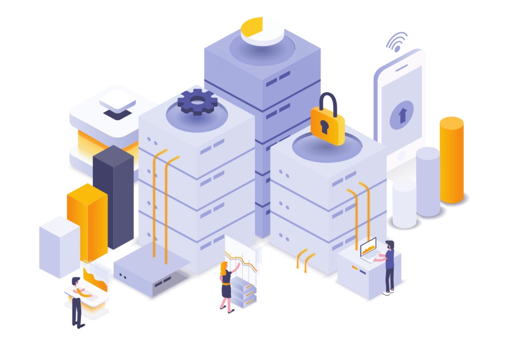

> Record, Replay, and memorize Technology

- 🚀 Node & Browser Support
- ⚡️️ Simple, Powerful, & Intuitive API
- 💎 First Class Mocha & QUnit Test Helpers
- 🔥 Intercept, Pass-Through, and Attach Events
- 📼 Record to Disk or Local Storage
- ⏱ Slow Down or Speed Up Time

  <a href="https://github.com/gopibabus/DocTemplate/" target="_blank">GitHub</a>
  <a href="#/README">Get Started</a>

